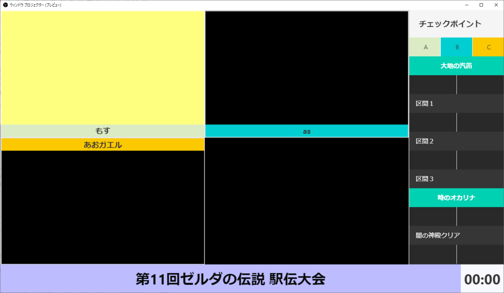

# relay-race-layout

NodeCG common bundle for speedrun relay race event

## Requirements

- Node.js 10 or later
- NodeCG 1.4.1 or later

## Installation

### With NodeCG CLI

`nodecg-cli`がインストールされている環境の場合

```
$ nodecg install cma2819/relay-race-layout
```

### Without NodeCG CLI

`nodecg-cli`がインストールされていない環境の場合

```
# nodecgがインストールされているディレクトリ上で実行してください
$ cd bundles
$ git clone https://github.com/cma2819/relay-race-layout.git
$ cd relay-race-layout
$ npm install --only=production
```

## Run NodeCG

```
$ nodecg start
```

or

```
# nodecgがインストールされているディレクトリ上で実行してください
$ node .
```

- Open NodeCG dashboard on `localhost:9090`

## Example



## Tutorials

1. [設定画面ダッシュボード](doc/tutorial/01_config_dashboard.md)
2. [進捗管理ダッシュボード](doc/tutorial/02_progress_dashboard.md)

## License

MIT License
