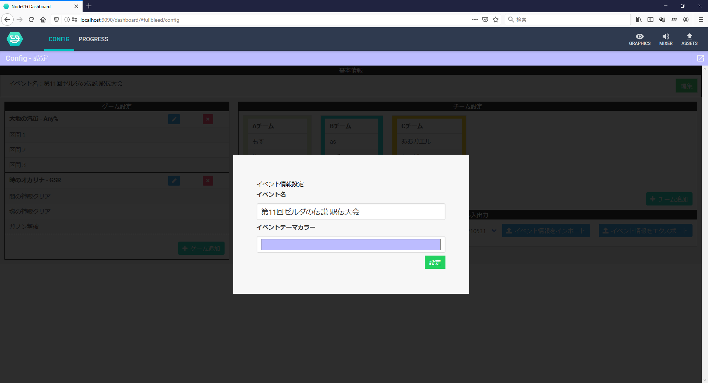
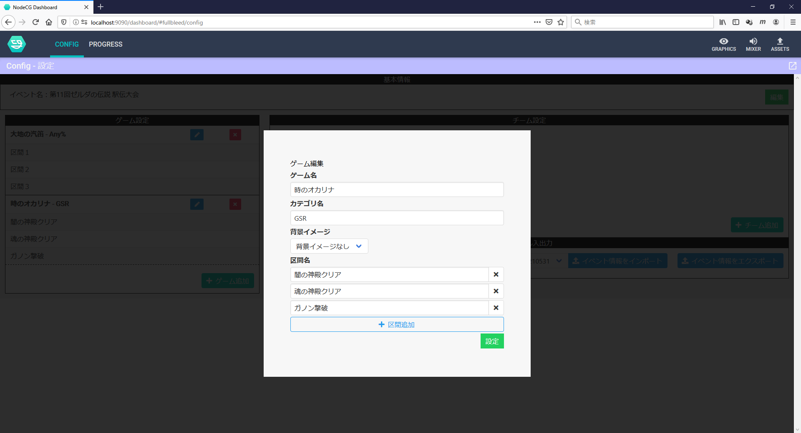
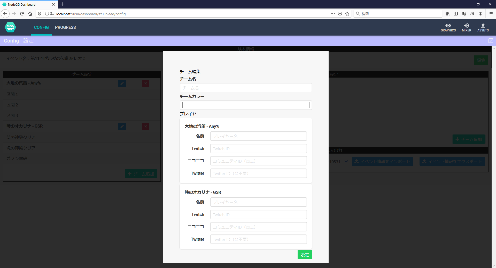
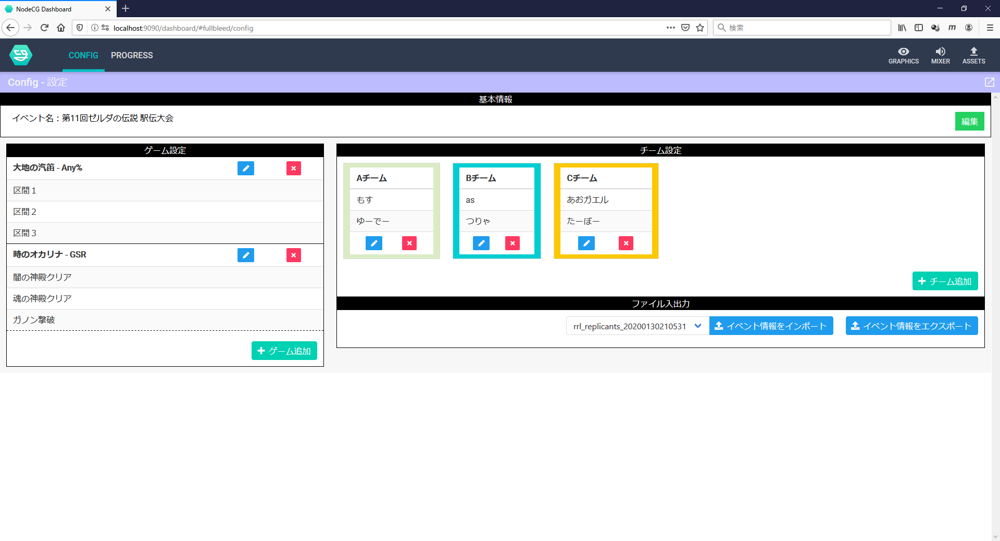

# 設定画面ダッシュボードの使い方

## 画面イメージ

## 操作説明

### 基本情報

イベント名を設定できます.
設定されたイベント名が表示されています.

### ゲーム設定

イベントでプレイされるゲームを設定できます.

ゲームは複数設定できます.
ゲーム毎に以下の情報を設定します.

- ゲーム名
- カテゴリ
- 区間名
  - 区間名は 1 つ以上, 任意の個数設定できます.

`ゲーム追加`ボタンでは新規のゲームを追加し, 鉛筆マークは該当行のゲーム情報を編集します. `×`ボタンはゲーム情報を削除します.

**ゲーム削除は元に戻すことはできません.**

### チーム設定

イベントに参加するチームを設定できます.

チームは 4 つまで設定できます.
チーム毎に以下の情報を設定します.

- チーム名
- プレイヤー名
  - プレイヤー名は 1 つ以上, 設定済みのゲームの個数まで設定できます.

`チーム追加`ボタンでは新規のチームを追加し, 鉛筆マークは該当エリアのチーム情報を編集します. `×`ボタンはチーム情報を削除します.

**チーム削除は元に戻すことはできません.**

### ファイル入出力

設定画面（config）で設定した情報をファイルで入出力することができます.

ここで出力（エクスポート）したファイルを共有することで, 複数の環境でも同一の設定でレイアウトを構築することができます.

#### エクスポート

現在設定されている情報が`.json`ファイルで出力されます. 出力されるのは設定画面（config）のもののみで, 別タブの情報は出力されません.

必要に応じてファイル名を変更するなどして, 保存・共有してご活用ください.

#### インポート

NodeCG の`ASSETS`タブを表示すると, `relay-race-layout`の`イベント初期データ`のエリアが表示されます.

このエリアに, エクスポートされた`.json`ファイルを追加（`ADD FILE(S)`を選択し, `UPLOAD FILES`もしくはファイルをドラッグアンドドロップ）すると, NodeCG に該当ファイルが読み込まれます.

読み込まれた状態で再度設定画面（config）に戻ると, 先ほど追加したファイル名がプルダウンで選択できるようになります.選択した状態で`イベント情報をインポート`を選択すると, 確認ダイアログが表示された後に設定のインポートが行われます.

**インポートする前に設定されていた情報は削除されるので, 必要に応じてファイルにエクスポートしてください.**

## サンプル

`sample.json`をインポートした場合, 以下のような設定が反映されます.

## 対応予定

そのうち追記
