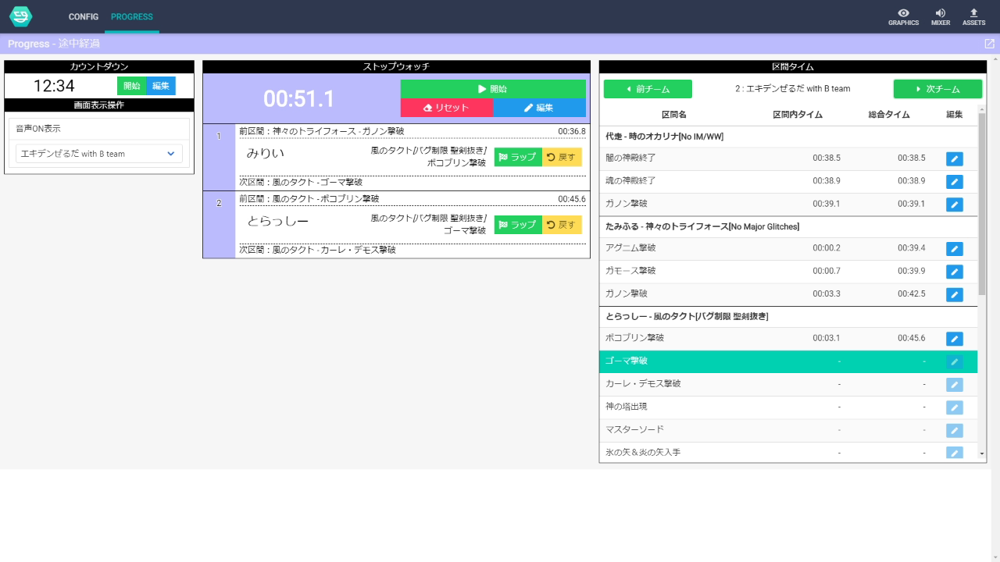
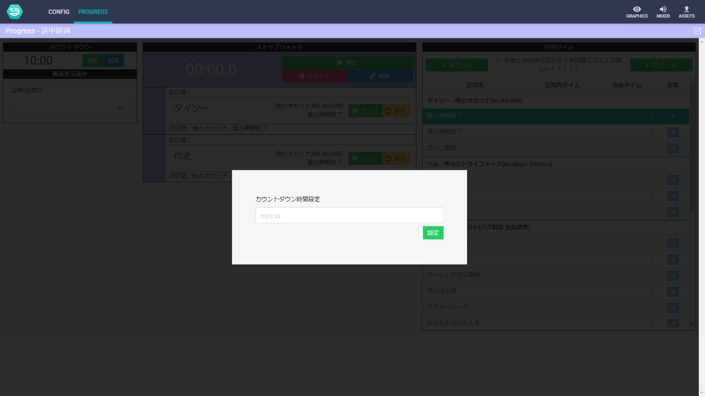
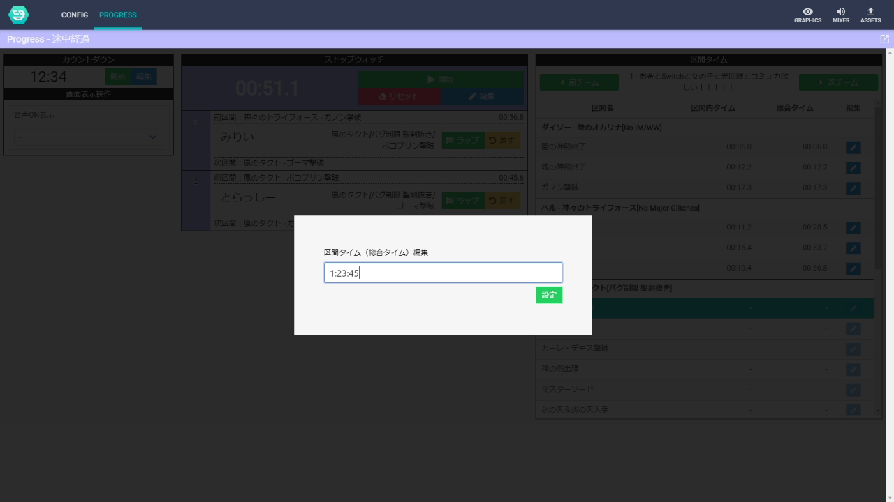

# 進捗管理画面ダッシュボードの使い方

## 画面イメージ

## 操作説明

### カウントダウン

イベント開始前等に表示するカウントダウンを制御します.`開始`を選択すると, `編集`で設定した時間からカウントダウンが動きます.

### 画面表示操作

画面表示に関わる設定を変更します.

- 音声 ON 表示
  - 各チームで音声が出力されている画面に音声 ON の表示を行います.

### ストップウォッチ

イベントで表示するマスタータイマーとなるストップウォッチです.

#### 開始・停止・リセット・編集

マスタータイマーの操作を行います.

`リセット`ボタンでは, 各チームの進捗状況もリセットされます.
設定画面（config）で設定したチーム情報が反映されていない場合も, `リセット`ボタンを選択してください.

#### ラップ・戻す

各走者の区間通過時に`ラップ`ボタンを選択してください.

誤って区間を進めてしまった場合は`戻す`ボタンで戻すことができます.

### 区間タイム

記録したラップタイムをチーム毎に表示します.
計測中の区間は選択表示されます.

鉛筆マークのボタンでは各区間の総合タイムを編集・設定できます.

## 対応予定

そのうち追記
